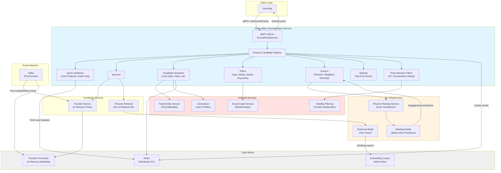
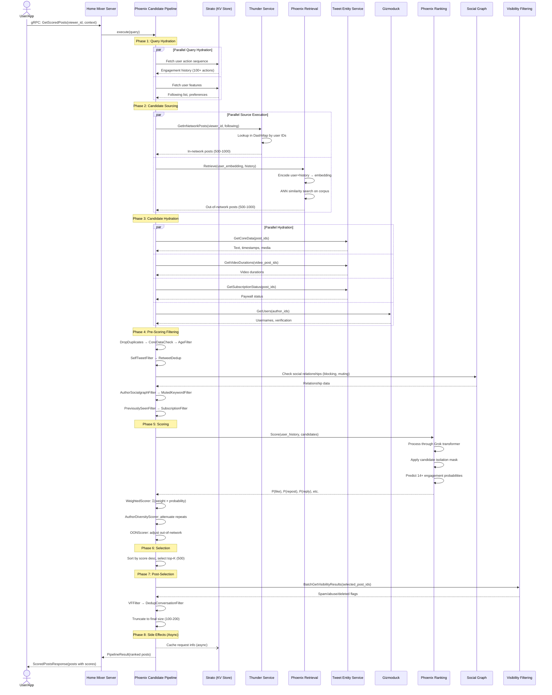
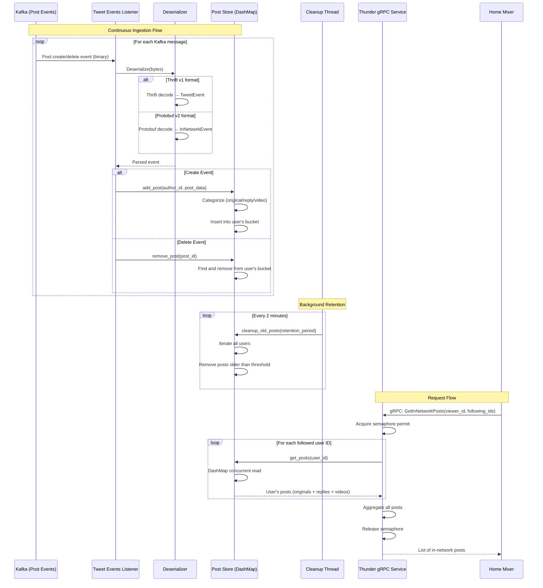
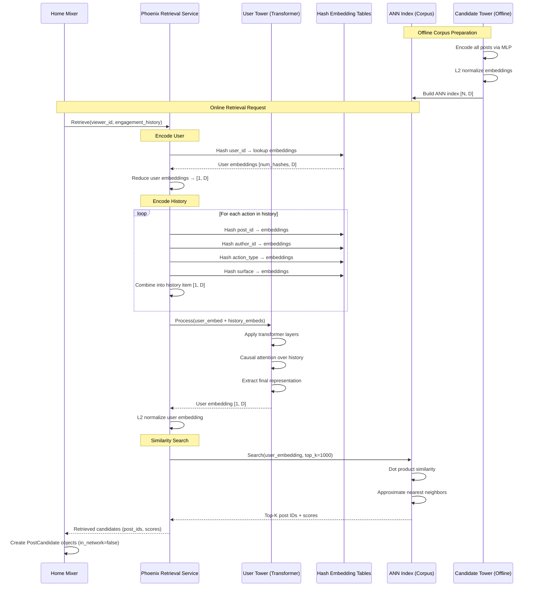
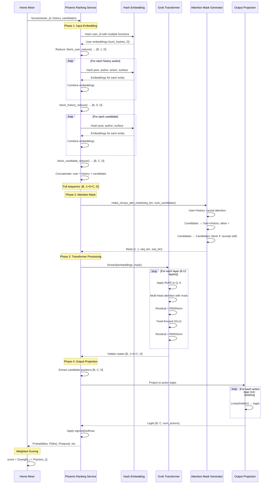
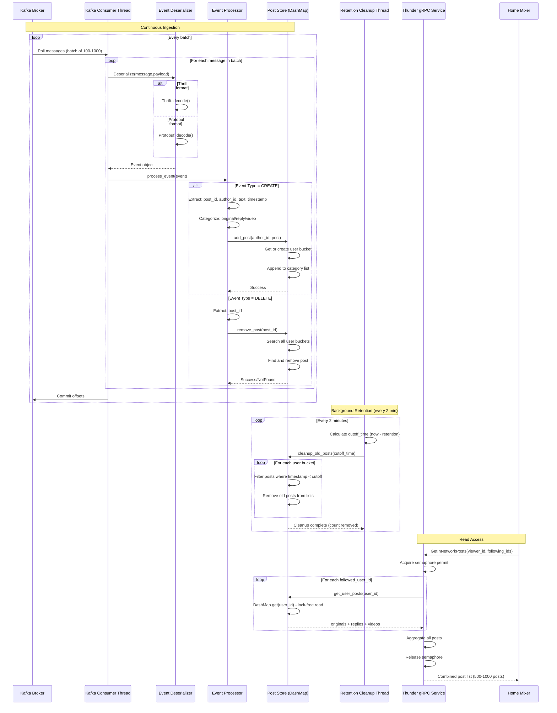

# X For You Feed Algorithm - Architecture Analysis

---

## Project Overview

The X For You Feed Algorithm is a sophisticated recommendation system that powers the "For You" feed on X (formerly Twitter). The system retrieves, ranks, and filters social media posts to create a personalized content feed for each user. It combines in-network content (posts from accounts the user follows) with out-of-network content (discovered through machine learning-based retrieval) to maximize user engagement.

The core innovation of this system is its use of a Grok-based transformer model (ported from the Grok-1 open source release by xAI) that predicts multiple engagement types (likes, replies, reposts, clicks, etc.) without hand-engineered features. The system has eliminated manual feature engineering and most heuristics, relying entirely on the transformer to learn relevance patterns from user engagement history.

The architecture follows a composable pipeline design with clear separation of concerns: candidate sourcing, hydration, filtering, scoring, selection, and post-processing. This design enables easy addition of new components and parallel execution of independent stages for optimal performance.

**Main Technologies:**
- **Languages**: Rust (backend services), Python (ML models)
- **Frameworks**: Tokio (async runtime), Tonic (gRPC), JAX/Haiku (ML framework)
- **Data Storage**: In-memory stores (DashMap), Strato (distributed KV store)
- **Messaging**: Kafka (event streaming)
- **ML Infrastructure**: Phoenix ranking and retrieval models with Grok-based transformers
- **APIs**: gRPC for service communication
- **Serialization**: Protocol Buffers, Thrift

---

## Architecture Overview

The X For You Feed system is built as a **modular monolith with microservice characteristics**. It consists of four main components that work together to generate personalized feeds: Home Mixer (orchestration), Thunder (in-network post storage), Phoenix (ML ranking and retrieval), and the Candidate Pipeline framework (reusable pipeline infrastructure).

The system operates in a **two-stage retrieval-then-ranking pipeline**. First, candidate posts are retrieved from multiple sources: Thunder provides recent posts from followed accounts (in-network), while Phoenix Retrieval uses a two-tower model to discover relevant posts from the global corpus (out-of-network). These candidates are then hydrated with additional metadata, filtered to remove ineligible content, and scored using the Phoenix Grok-based transformer. The transformer predicts engagement probabilities for 14+ action types, which are combined into a weighted final score. After diversity adjustments and final visibility checks, the top-K posts are returned to the user.

**Data Flows:**
- **Ingestion Flow**: Kafka streams post create/delete events → Thunder stores them in-memory for fast lookups
- **Request Flow**: User request → Home Mixer orchestrates pipeline → retrieves from Thunder + Phoenix → scores with ML → returns ranked posts
- **ML Inference Flow**: User history + candidates → Phoenix ranking service → engagement probability predictions → weighted scoring
- **Retrieval Flow**: User embedding + corpus embeddings → ANN similarity search → top-K candidates

**External Systems:**
- **Strato**: Distributed key-value store for user features, engagement history, and caching
- **Kafka**: Event stream for real-time post ingestion
- **Tweet Entity Service (TES)**: Provides core post metadata, media info, and video durations
- **Gizmoduck**: User profile service for author information
- **Visibility Filtering (VF)**: Content moderation service for spam/abuse detection
- **Social Graph Service**: Provides following/blocking/muting relationships

### Architecture Diagram

---

## Key Features

The X For You Feed system provides a comprehensive set of features organized hierarchically:

### 1. Feed Generation
**Description**: Core functionality that generates personalized "For You" feeds by retrieving, ranking, and filtering posts from multiple sources.

**Entry Points**: 
- gRPC endpoint: `ScoredPostsService.GetScoredPosts()`
- Service: `home-mixer/server.rs::HomeMixerServer`

**Components & Data**:
- Home Mixer orchestration service
- Candidate Pipeline framework
- Phoenix ML services
- Thunder in-network store

#### 1.1 Query Hydration
**Description**: Enriches incoming user requests with contextual data needed for downstream processing, including user engagement history and profile features.

**Entry Points**:
- `home-mixer/query_hydrators/user_action_seq_query_hydrator.rs`
- `home-mixer/query_hydrators/user_features_query_hydrator.rs`

**Components & Data**:
- User Action Sequence Fetcher (fetches from Strato)
- Strato client for user features
- Query object enrichment

#### 1.2 Candidate Sourcing
**Description**: Retrieves candidate posts from multiple sources in parallel to form the initial pool for ranking.

**Entry Points**:
- `home-mixer/sources/thunder_source.rs::ThunderSource`
- `home-mixer/sources/phoenix_source.rs::PhoenixSource`

**Components & Data**:
- Thunder service (in-network posts)
- Phoenix retrieval service (out-of-network posts)
- Source trait implementations

##### 1.2.1 In-Network Retrieval (Thunder)
**Description**: Retrieves recent posts from accounts the user follows, stored in-memory for sub-millisecond access.

**Entry Points**:
- gRPC: `InNetworkPostsService.GetInNetworkPosts()`
- `thunder/thunder_service.rs::ThunderService`

**Components & Data**:
- Thunder gRPC service
- In-memory post store (DashMap)
- User following list from Social Graph

##### 1.2.2 Out-of-Network Retrieval (Phoenix)
**Description**: Uses ML-based similarity search to discover relevant posts from the global corpus that the user doesn't follow.

**Entry Points**:
- Phoenix retrieval gRPC endpoint
- `phoenix/recsys_retrieval_model.py::PhoenixRetrievalModel`

**Components & Data**:
- Two-tower retrieval model
- User embedding encoder
- Candidate embedding corpus
- ANN similarity search index

#### 1.3 Candidate Hydration
**Description**: Enriches candidate posts with additional metadata required for filtering and scoring.

**Entry Points**:
- `home-mixer/candidate_hydrators/core_data_candidate_hydrator.rs`
- `home-mixer/candidate_hydrators/gizmoduck_hydrator.rs`
- `home-mixer/candidate_hydrators/video_duration_candidate_hydrator.rs`
- `home-mixer/candidate_hydrators/subscription_hydrator.rs`
- `home-mixer/candidate_hydrators/in_network_candidate_hydrator.rs`

**Components & Data**:
- Tweet Entity Service (TES) for post metadata
- Gizmoduck for author profiles
- Subscription service for paywall status
- Parallel hydration execution

#### 1.4 Candidate Filtering
**Description**: Removes ineligible posts based on quality, eligibility, and user preferences. Runs in sequential stages.

**Entry Points**:
- Multiple filter implementations in `home-mixer/filters/`

**Components & Data**:
- 10+ filter implementations
- Social graph relationships
- User preference data
- Bloom filters for seen posts

##### 1.4.1 Quality Filters
**Description**: Removes posts that fail basic quality criteria or data hydration.

**Entry Points**:
- `filters/drop_duplicates_filter.rs`
- `filters/core_data_hydration_filter.rs`
- `filters/age_filter.rs`

**Components & Data**:
- Duplicate detection
- Hydration validation
- Age threshold checks

##### 1.4.2 Eligibility Filters
**Description**: Removes posts the user shouldn't see based on account relationships and content access.

**Entry Points**:
- `filters/self_tweet_filter.rs`
- `filters/author_socialgraph_filter.rs`
- `filters/ineligible_subscription_filter.rs`

**Components & Data**:
- Social graph (blocking, muting)
- Subscription status
- Self-post detection

##### 1.4.3 User Preference Filters
**Description**: Respects user preferences by removing posts with muted keywords or previously seen content.

**Entry Points**:
- `filters/muted_keyword_filter.rs`
- `filters/previously_seen_posts_filter.rs`
- `filters/previously_served_posts_filter.rs`

**Components & Data**:
- User muted keyword list
- Seen post tracking
- Session-based served tracking

#### 1.5 Candidate Scoring
**Description**: Computes relevance scores for each candidate using ML predictions and weighted combinations.

**Entry Points**:
- `home-mixer/scorers/phoenix_scorer.rs`
- `home-mixer/scorers/weighted_scorer.rs`
- `home-mixer/scorers/author_diversity_scorer.rs`
- `home-mixer/scorers/oon_scorer.rs`

**Components & Data**:
- Phoenix ranking service
- Score computation logic
- Sequential scorer pipeline

##### 1.5.1 ML Ranking (Phoenix)
**Description**: Uses Grok-based transformer to predict engagement probabilities for multiple action types.

**Entry Points**:
- Phoenix ranking gRPC endpoint
- `phoenix/recsys_model.py::PhoenixModel`
- `phoenix/runners.py::RecsysInferenceRunner`

**Components & Data**:
- Grok transformer with candidate isolation
- Multi-action prediction (14+ actions)
- Hash-based embeddings
- User history processing

##### 1.5.2 Weighted Scoring
**Description**: Combines ML predictions into a single relevance score using configured weights for each action type.

**Entry Points**:
- `scorers/weighted_scorer.rs::WeightedScorer`

**Components & Data**:
- Action weights (positive for likes, negative for blocks)
- Linear combination formula
- Score aggregation

##### 1.5.3 Diversity Scoring
**Description**: Adjusts scores to promote author diversity and prevent feed domination by single authors.

**Entry Points**:
- `scorers/author_diversity_scorer.rs::AuthorDiversityScorer`

**Components & Data**:
- Author count tracking
- Score attenuation for repeated authors
- Diversity promotion logic

#### 1.6 Candidate Selection
**Description**: Sorts candidates by final score and selects the top-K for the final result set.

**Entry Points**:
- `home-mixer/selectors/top_k_score_selector.rs::TopKScoreSelector`

**Components & Data**:
- Score-based sorting
- Top-K truncation
- Selection logic

#### 1.7 Post-Selection Processing
**Description**: Final validation and filtering after selection, including visibility checks and conversation deduplication.

**Entry Points**:
- `filters/vf_filter.rs::VFFilter`
- `filters/dedup_conversation_filter.rs::DedupConversationFilter`
- `candidate_hydrators/vf_candidate_hydrator.rs::VFCandidateHydrator`

**Components & Data**:
- Visibility Filtering service
- Conversation thread detection
- Final quality gates

### 2. Post Ingestion
**Description**: Real-time ingestion pipeline that consumes post events from Kafka and maintains in-memory stores for fast retrieval.

**Entry Points**:
- `thunder/kafka/tweet_events_listener.rs` (v1 - Thrift)
- `thunder/kafka/tweet_events_listener_v2.rs` (v2 - Protobuf)
- `thunder/main.rs::start_kafka_listeners()`

**Components & Data**:
- Kafka consumer groups
- Event deserialization
- Post store updates
- Multi-threaded processing

#### 2.1 Event Processing
**Description**: Processes post create/delete events from Kafka and updates the in-memory store.

**Entry Points**:
- `kafka/tweet_events_listener.rs::process_tweet_event()`
- `kafka/tweet_events_listener_v2.rs::process_in_network_event()`

**Components & Data**:
- Thrift/Protobuf deserialization
- Event type handling (create/delete)
- Store mutation logic

#### 2.2 Post Storage
**Description**: Maintains categorized in-memory stores for posts with automatic retention cleanup.

**Entry Points**:
- `thunder/posts/post_store.rs::PostStore`

**Components & Data**:
- DashMap-based concurrent storage
- Per-user categorization (original, replies, videos)
- Retention policy enforcement
- Automatic cleanup (every 2 minutes)

### 3. ML Model Inference
**Description**: Machine learning infrastructure for candidate retrieval and ranking using Grok-based transformers.

**Entry Points**:
- `phoenix/runners.py::RecsysInferenceRunner`
- `phoenix/runners.py::RecsysRetrievalInferenceRunner`

**Components & Data**:
- JAX-based model execution
- Model initialization and checkpointing
- Batch inference

#### 3.1 Ranking Inference
**Description**: Predicts engagement probabilities using transformer with candidate isolation masking.

**Entry Points**:
- `phoenix/recsys_model.py::PhoenixModel.forward()`
- `phoenix/runners.py::RecsysInferenceRunner.rank()`

**Components & Data**:
- Grok transformer layers
- Candidate isolation attention mask
- Multi-action output heads
- Hash-based embedding lookup

#### 3.2 Retrieval Inference
**Description**: Encodes users and candidates into embeddings for similarity-based retrieval.

**Entry Points**:
- `phoenix/recsys_retrieval_model.py::PhoenixRetrievalModel`
- `phoenix/runners.py::encode_user()` / `encode_candidates()`

**Components & Data**:
- User tower (transformer-based)
- Candidate tower (MLP-based)
- L2 normalization
- Dot product similarity

### 4. Pipeline Framework
**Description**: Reusable, composable framework for building recommendation pipelines with trait-based stages.

**Entry Points**:
- `candidate-pipeline/candidate_pipeline.rs::CandidatePipeline`

**Components & Data**:
- Pipeline trait definitions
- Parallel/sequential execution control
- Error handling and logging
- Metrics tracking

#### 4.1 Pipeline Execution
**Description**: Orchestrates the execution of all pipeline stages with proper ordering and parallelism.

**Entry Points**:
- `candidate_pipeline.rs::execute()`

**Components & Data**:
- Stage execution order
- Parallel task spawning
- Result aggregation
- Pipeline state management

#### 4.2 Pipeline Stages
**Description**: Individual stage traits that define the pipeline behavior.

**Entry Points**:
- `source.rs::Source`
- `hydrator.rs::Hydrator`
- `filter.rs::Filter`
- `scorer.rs::Scorer`
- `selector.rs::Selector`
- `side_effect.rs::SideEffect`

**Components & Data**:
- Trait definitions
- Enable/disable logic
- Async execution
- Error handling

---

## Feature Deep Dives

### Feed Generation Request

#### Overview
The core user-facing feature where a client requests a personalized "For You" feed. The system retrieves candidates from multiple sources, enriches them with metadata, filters out ineligible content, scores using ML predictions, and returns the top-K ranked posts.

#### End-to-End Technical Flow

1. **Request Initiation**: User's app sends gRPC request to Home Mixer service with viewer ID, client info, and context (seen posts, country, language).

2. **Query Hydration**: Home Mixer fetches user engagement history (last 100-200 actions) from Strato and user features (following list, preferences) in parallel.

3. **Candidate Sourcing (Parallel)**:
   - Thunder Source: Queries Thunder service for recent posts from followed accounts
   - Phoenix Source: Calls Phoenix Retrieval service to get ML-discovered candidates from global corpus

4. **Thunder In-Network Lookup**: Thunder service uses viewer's following list to lookup posts in its in-memory DashMap store, categorized by type (original, replies, videos).

5. **Phoenix Retrieval**: Phoenix encodes user+history into an embedding vector, performs ANN similarity search against the candidate corpus, returns top-K similar posts.

6. **Candidate Hydration (Parallel)**: For all candidates, fetch metadata:
   - Core post data from TES (text, timestamps, media)
   - Author profiles from Gizmoduck (username, verification)
   - Video durations from TES (for video posts)
   - Subscription status from TES (paywall info)

7. **Pre-Scoring Filtering (Sequential)**: Apply filters in order:
   - Drop duplicate post IDs
   - Remove posts that failed hydration
   - Remove posts older than threshold (48 hours)
   - Remove viewer's own posts
   - Deduplicate reposts of same content
   - Remove ineligible subscription content
   - Remove previously seen posts (from bloom filter)
   - Remove previously served posts (in current session)
   - Remove posts with muted keywords
   - Remove posts from blocked/muted authors (via Social Graph)

8. **ML Scoring**: Phoenix Ranking service processes user history + candidates through Grok transformer with candidate isolation masking, outputs engagement probabilities for 14+ actions (like, repost, reply, click, etc.).

9. **Weighted Scoring**: Combine ML predictions into single score: `score = Σ(weight_i × P(action_i))`. Positive actions get positive weights, negative actions (block, mute) get negative weights.

10. **Diversity Scoring**: Attenuate scores for posts from authors that already appear multiple times in the candidate set to promote feed diversity.

11. **OON Adjustment**: Apply additional scoring adjustments for out-of-network content based on business logic.

12. **Selection**: Sort all candidates by final score descending, select top-K (typically 500).

13. **Post-Selection Hydration**: Fetch visibility filtering data from VF service for selected candidates.

14. **Post-Selection Filtering**:
    - VF Filter: Remove posts flagged as spam/violence/gore/deleted
    - Conversation Dedup: Remove duplicate branches of same conversation thread

15. **Final Truncation**: Cap results to configured size (typically 100-200 posts).

16. **Side Effects (Async)**: Spawn background tasks to cache request info in Strato for future use.

17. **Response**: Return ranked list of posts with scores, author info, and metadata to client.

#### Mermaid Sequence Diagram

#### Implementation Index

- `home-mixer/server.rs::HomeMixerServer::get_scored_posts()` - gRPC endpoint handler
- `home-mixer/candidate_pipeline/phoenix_candidate_pipeline.rs::PhoenixCandidatePipeline` - Pipeline configuration
- `candidate-pipeline/candidate_pipeline.rs::CandidatePipeline::execute()` - Pipeline execution logic
- `home-mixer/query_hydrators/user_action_seq_query_hydrator.rs` - User history fetcher
- `home-mixer/sources/thunder_source.rs::ThunderSource` - In-network source
- `home-mixer/sources/phoenix_source.rs::PhoenixSource` - Out-of-network source
- `home-mixer/scorers/phoenix_scorer.rs::PhoenixScorer` - ML scoring
- `home-mixer/scorers/weighted_scorer.rs::WeightedScorer` - Score combination
- `home-mixer/selectors/top_k_score_selector.rs::TopKScoreSelector` - Selection logic

---

### Thunder In-Network Retrieval

#### Overview
Thunder provides sub-millisecond retrieval of recent posts from accounts the user follows. It maintains an in-memory store of all recent posts, categorized by user and post type, enabling fast lookups without database queries.

#### End-to-End Technical Flow

1. **Post Event Stream**: Kafka continuously streams post create/delete events (from various product surfaces) to Thunder service.

2. **Event Consumption**: Thunder runs multiple Kafka consumer threads (one per partition) that deserialize events from Thrift (v1) or Protobuf (v2) format.

3. **Event Processing**: For each event:
   - Create events: Extract post ID, author ID, text, timestamp, reply/repost info
   - Delete events: Extract post ID to remove

4. **Store Update**: 
   - Create: Insert post into DashMap under author's user ID, categorized as original/reply/video
   - Delete: Remove post from DashMap

5. **Automatic Retention**: Background thread runs every 2 minutes, removes posts older than retention period (typically 48 hours) from all user buckets.

6. **Request Handling**: When Home Mixer requests in-network posts:
   - Extract viewer's following list from query
   - For each followed user ID, lookup their posts in DashMap (concurrent read)
   - Aggregate posts from all followed users
   - Return combined list

7. **Concurrency Control**: Thunder service uses a Semaphore to limit concurrent requests and prevent overload.

8. **Response**: Return list of in-network post candidates to caller.

#### Mermaid Sequence Diagram

#### Implementation Index

- `thunder/main.rs::main()` - Service initialization and Kafka listener startup
- `thunder/kafka_utils.rs::start_kafka_listeners()` - Kafka consumer setup
- `thunder/kafka/tweet_events_listener_v2.rs::process_in_network_event()` - Event processing (v2)
- `thunder/deserializer.rs` - Event deserialization (Thrift/Protobuf)
- `thunder/posts/post_store.rs::PostStore` - In-memory store with DashMap
- `thunder/posts/post_store.rs::PostStore::add_post()` - Insert operation
- `thunder/posts/post_store.rs::PostStore::remove_post()` - Delete operation
- `thunder/posts/post_store.rs::PostStore::cleanup_old_posts()` - Retention cleanup
- `thunder/thunder_service.rs::ThunderService::get_in_network_posts()` - gRPC handler

---

### Phoenix Out-of-Network Retrieval

#### Overview
Phoenix Retrieval uses a two-tower neural architecture to discover relevant posts from the global corpus that the user doesn't follow. It encodes the user's preferences into an embedding vector and performs approximate nearest neighbor (ANN) search to find similar posts.

#### End-to-End Technical Flow

1. **Corpus Preparation (Offline)**: All posts in the system are encoded using the Candidate Tower (MLP) into normalized embeddings `[N, D]` and indexed in an ANN data structure.

2. **Retrieval Request**: Home Mixer sends user context (viewer ID, engagement history) to Phoenix Retrieval service.

3. **User Encoding**: 
   - Extract user features (hashed user ID, demographics)
   - Extract engagement history (last 100-200 actions with post IDs, author IDs, action types)
   - Process through User Tower (transformer-based)
   - Apply L2 normalization → user embedding `[1, D]`

4. **History Processing**: User Tower processes engagement sequence:
   - Each action represented as: (post_hash, author_hash, action_type_hash, surface_hash)
   - Hash-based embedding lookup for each entity
   - Combine embeddings via summation or concatenation
   - Pass through transformer layers with causal attention
   - Extract final representation

5. **Similarity Search**: 
   - Compute dot product between user embedding and all candidate embeddings
   - Use ANN index (e.g., FAISS, ScaNN) for efficient search
   - Retrieve top-K candidates with highest similarity scores

6. **Result Return**: Return list of post IDs with similarity scores to Home Mixer.

7. **Candidate Creation**: Home Mixer creates PostCandidate objects for retrieved posts, marking them as out-of-network.

#### Mermaid Sequence Diagram

#### Implementation Index

- `phoenix/recsys_retrieval_model.py::PhoenixRetrievalModel` - Two-tower model definition
- `phoenix/recsys_retrieval_model.py::CandidateTower` - Candidate encoder (MLP)
- `phoenix/runners.py::RecsysRetrievalInferenceRunner::encode_user()` - User encoding
- `phoenix/runners.py::RecsysRetrievalInferenceRunner::encode_candidates()` - Candidate encoding
- `phoenix/runners.py::RecsysRetrievalInferenceRunner::retrieve()` - Top-K retrieval
- `phoenix/grok.py::Transformer` - Transformer implementation for user tower
- `home-mixer/sources/phoenix_source.rs::PhoenixSource::get_candidates()` - Client integration

---

### Phoenix ML Ranking with Candidate Isolation

#### Overview
The Phoenix ranking model is a Grok-based transformer that predicts engagement probabilities for each candidate post. The key innovation is **candidate isolation masking**, which ensures that the score for each candidate is independent of other candidates in the batch, making scores consistent and cacheable.

#### End-to-End Technical Flow

1. **Ranking Request**: Home Mixer sends scored posts request to Phoenix Ranking service with:
   - User context (viewer ID, demographics)
   - Engagement history (100-200 actions)
   - Candidate posts (typically 500-2000 after filtering)

2. **Input Preparation**:
   - **User Block**: Hash user ID with multiple hash functions → lookup embeddings → reduce to [B, 1, D]
   - **History Block**: For each action:
     - Hash post ID, author ID, action type, surface
     - Lookup embeddings for each
     - Combine into history item
     - Result: [B, S, D] where S = history length
   - **Candidate Block**: For each candidate:
     - Hash post ID, author ID, surface
     - Lookup embeddings
     - Combine into candidate item
     - Result: [B, C, D] where C = num candidates

3. **Sequence Construction**: Concatenate user + history + candidates into single sequence: [B, 1+S+C, D]

4. **Attention Mask Creation**: Generate special attention mask:
   - User can attend to itself: ✓
   - History items can attend to user + all previous history: ✓ (causal)
   - Candidates can attend to user + all history + themselves: ✓
   - **Candidates CANNOT attend to other candidates**: ✗ (key innovation)

5. **Transformer Processing**:
   - Pass sequence through N transformer layers (typically 8-12)
   - Each layer: Multi-head attention (with mask) → RMSNorm → FFN → RMSNorm
   - Rotary position embeddings (RoPE) for position info
   - Residual connections throughout

6. **Output Extraction**: Extract hidden states at candidate positions (skip user + history positions)

7. **Action Prediction**: 
   - For each candidate, apply output projection layers
   - Generate logits for 14+ action types: [B, C, num_actions]
   - Action types: like, repost, reply, quote, click, profile_click, video_view, photo_expand, share, dwell, follow_author, not_interested, block_author, mute_author, report

8. **Probability Conversion**: Apply softmax or sigmoid to logits → probabilities for each action

9. **Response**: Return engagement probability matrix [B, C, num_actions] to Home Mixer

10. **Score Integration**: Home Mixer's WeightedScorer combines probabilities into final scores

#### Mermaid Sequence Diagram

#### Implementation Index

- `phoenix/recsys_model.py::PhoenixModel` - Main ranking model
- `phoenix/recsys_model.py::block_user_reduce()` - User embedding processing
- `phoenix/recsys_model.py::block_history_reduce()` - History embedding processing
- `phoenix/recsys_model.py::block_candidate_reduce()` - Candidate embedding processing
- `phoenix/grok.py::make_recsys_attn_mask()` - **Critical: Candidate isolation mask generation**
- `phoenix/grok.py::Transformer` - Transformer implementation
- `phoenix/grok.py::DecoderLayer` - Single transformer layer
- `phoenix/grok.py::MultiHeadAttention` - Attention mechanism with masking
- `phoenix/runners.py::RecsysInferenceRunner::rank()` - Inference execution
- `home-mixer/scorers/phoenix_scorer.rs::PhoenixScorer::score()` - Client integration

#### Limitations / Unknowns

- The exact hash configuration (number of hash functions per entity type) is not visible in the codebase and appears to be model-specific.
- Specific weight values for the weighted scoring formula are likely configuration-based and not hardcoded in the shown code.
- The ANN index implementation and update frequency for the retrieval corpus are not detailed in the codebase.
- Model checkpoint loading and versioning strategy is abstracted in the runner code.

---

### Post Ingestion and Storage

#### Overview
Thunder continuously ingests post events from Kafka and maintains an in-memory store for fast retrieval. This enables sub-millisecond lookups of in-network content without database queries.

#### End-to-End Technical Flow

1. **Service Initialization**: Thunder server starts with:
   - Empty PostStore (DashMap-based)
   - Kafka consumer configuration
   - gRPC server setup

2. **Kafka Consumer Setup**:
   - Create consumer groups for post event topics
   - Subscribe to configured topics
   - Configure partition assignment (one thread per partition for v2)

3. **Event Stream Processing**:
   - Kafka delivers batches of messages to consumer threads
   - Each message contains a serialized post event (Thrift v1 or Protobuf v2)

4. **Event Deserialization**:
   - Detect format (Thrift vs Protobuf)
   - Deserialize binary payload into structured event object
   - Extract: event type (create/delete), post ID, author ID, text, timestamps, reply/repost info

5. **Event Type Handling**:
   - **Create Event**:
     - Extract all post fields
     - Categorize post type: original vs reply vs video
     - Call `PostStore.add_post(author_id, post_data)`
   - **Delete Event**:
     - Extract post ID
     - Call `PostStore.remove_post(post_id)`

6. **Store Mutation**:
   - **Add**: Insert post into DashMap under author's user ID bucket
   - Each user bucket has three sub-categories: originals, replies, videos
   - DashMap provides concurrent write access without locking entire structure
   - **Remove**: Search across all user buckets to find and remove post

7. **Automatic Retention**:
   - Background thread spawned at startup
   - Runs every 2 minutes
   - Iterates through all user buckets
   - Removes posts where `current_time - post_timestamp > retention_period`
   - Typical retention: 48 hours

8. **Concurrent Read Access**:
   - gRPC service handles GetInNetworkPosts requests
   - Semaphore limits concurrent requests
   - For each followed user, read posts from DashMap (lock-free reads)
   - Aggregate posts from all followed users
   - Return combined list

9. **Metrics and Monitoring**:
   - Track ingestion rate (posts/sec)
   - Track store size (total posts)
   - Track retrieval latency
   - Track retention cleanup stats

#### Mermaid Sequence Diagram

#### Implementation Index

- `thunder/main.rs::main()` - Server initialization and thread spawning
- `thunder/kafka_utils.rs::start_kafka_listeners()` - Consumer setup and thread management
- `thunder/kafka/tweet_events_listener_v2.rs::start_listener()` - Partition-based processing (v2)
- `thunder/kafka/tweet_events_listener.rs::consume_events()` - Simple processing (v1)
- `thunder/deserializer.rs::deserialize_thrift()` - Thrift deserialization
- `thunder/deserializer.rs::deserialize_protobuf()` - Protobuf deserialization
- `thunder/posts/post_store.rs::PostStore` - DashMap-based storage
- `thunder/posts/post_store.rs::add_post()` - Insert operation
- `thunder/posts/post_store.rs::remove_post()` - Delete operation
- `thunder/posts/post_store.rs::cleanup_old_posts()` - Retention logic
- `thunder/posts/post_store.rs::get_user_posts()` - Read operation
- `thunder/thunder_service.rs::get_in_network_posts()` - gRPC handler

---

## Unknowns and Assumptions

### Architecture Gaps

1. **Strato Implementation Details**: The codebase references Strato as a distributed key-value store for user features, engagement history, and caching, but the actual implementation is not visible. It appears to be an internal X infrastructure component. Assumed to be similar to systems like Cassandra or DynamoDB based on usage patterns.

2. **Phoenix Model Training Pipeline**: The ranking and retrieval models are shown as inference-only code. The training pipeline, including:
   - Data collection and labeling
   - Training infrastructure and distributed training
   - Model evaluation metrics
   - Deployment and versioning strategy
   - A/B testing framework
   
   These are not visible in the codebase. Based on comments in the README, it appears models are trained offline and loaded from checkpoints.

3. **ANN Index Implementation**: Phoenix retrieval uses an ANN index for similarity search, but the specific implementation (FAISS, ScaNN, custom) is abstracted. The corpus update frequency and index rebuild strategy are not documented.

4. **Configuration Management**: Many parameters are referenced (e.g., `params::MAX_POST_AGE`, `params::RESULT_SIZE`) but their values and configuration mechanism are not shown. Assumed to be environment-based configuration or feature flags.

5. **Authentication and Authorization**: The gRPC services shown don't include visible authentication/authorization logic. Assumed to be handled by a service mesh or gateway layer not shown in this codebase.

6. **Monitoring and Alerting**: While metrics are tracked, the observability infrastructure (Prometheus, Grafana, etc.) and alerting setup are not visible.

### Feature Assumptions

1. **Score Weight Configuration**: The weighted scoring formula `Σ(weight_i × P(action_i))` uses configured weights, but their specific values are not in the codebase. Assumed to be tuned through experimentation and updated via configuration.

2. **Hash Function Details**: The hash-based embeddings use multiple hash functions per entity type, but the exact number and hash algorithms are model-specific and not documented. Assumed to use standard hash functions (MurmurHash, xxHash, etc.).

3. **Retention Period**: Post retention in Thunder is mentioned as 48 hours in documentation, but the exact value appears to be configurable. The trade-off between memory usage and feed recency is assumed to be tuned operationally.

4. **Batch Sizes**: Various batch sizes are referenced (retrieval top-K, ranking batch size, selection size) but exact values are not always visible. Assumed to be tuned based on latency and quality metrics.

5. **Error Handling Strategy**: The pipeline framework has error handling logic, but the specific retry strategies, circuit breakers, and fallback behaviors are partially abstracted. Assumed to follow standard resilience patterns.

### Data Flow Ambiguities

1. **User Action Sequence Format**: The engagement history format from Strato is referenced but not fully specified. Assumed to be a time-ordered list of actions with post IDs, author IDs, action types, and timestamps.

2. **Social Graph Service**: References to Social Graph for relationships are shown, but the service interface and data model are not detailed. Assumed to provide blocking, muting, and following relationships.

3. **Visibility Filtering Service**: The VF service is called for content moderation, but the specific rules and ML models used are not visible. Assumed to be a separate ML-based service for safety.

4. **Video Duration Hydration**: The necessity and usage of video duration in scoring is referenced but not fully explained. Assumed to be used for dwell time prediction or video-specific ranking adjustments.

### Evidence for Assumptions

- **README.md**: Provides high-level architecture overview and design decisions
- **server.rs**: Shows gRPC endpoint structure and request/response flow
- **phoenix_candidate_pipeline.rs**: Reveals pipeline stage configuration and component initialization
- **post_store.rs**: Shows DashMap-based storage implementation and retention logic
- **recsys_model.py**: Demonstrates transformer architecture and candidate isolation
- **grok.py**: Reveals attention masking implementation

### Recommended Next Steps for Investigation

1. Examine Strato client implementation to understand data model
2. Review configuration files or environment variables for parameter values
3. Investigate model training repository (likely separate)
4. Review deployment and infrastructure-as-code for service mesh setup
5. Check monitoring dashboards for operational parameters
6. Interview team members about score weight tuning process
7. Review A/B testing infrastructure for model evaluation
